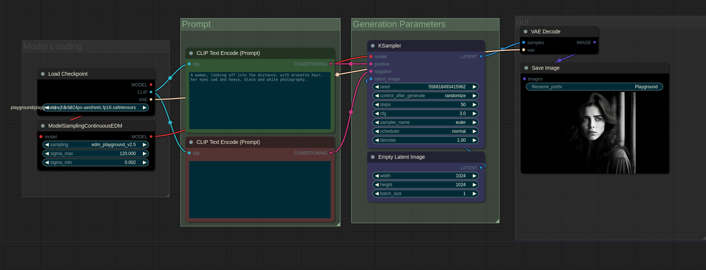

# Consume-ComfyUI-Workflows
This repository contains a collection of `.json` and `.png` files, each representing a unique workflow for [ComfyUI]. Click on the links to view and download the workflow that suits your needs.

## Table of Contents
1. [How To Use](#getting-started)
2. [Workflow List](#workflow-list)
3. [SDXL Turbo to SD1.5 Refiner](#sdxl-turbo-to-sd15-refiner)
4. [Frames to Video](#frames-to-video)
5. [Basic First to Last frame interpolation](#first-to-last-frame-interpolation)
6. [SDXL Lightning](#sdxl-lightning-basics)
7. [Playground V2](#playground-v2)
8. [Inpainting w/ Differential Diffusion](#differential-diffusion)
9. [Motion Lora Training w/ Motion Director](#motion-director)
10. [TripoSR Automatic 3D Asset Creation](#tripo-sr)
   

## Getting Started

To make things a lot easier to set up, ensure that you have the ComfyUI manager installed. This will allow you to install any missing nodes easily by navigating into the manager and selecting `Install Missing Custom Nodes`
- drag the desired workflow into the ComfyUI interface
- selecting the missing nodes from the list
- head into the ComfyUI Commandline/Terminal and Ctrl+C to shut down the application
- start ComfyUI back up and the software should now have the missing node
- note, some workflows may need you to also download models specific to their workflows... I'll try to leave info on this if necessary

The ComfyUI manager can be install from this repo:
`https://github.com/ltdrdata/ComfyUI-Manager`
To install the manager simply:
- navigate into the custom nodes directory `ComfyUI/custom_nodes`
- `git clone https://github.com/ltdrdata/ComfyUI-Manager.git` in your commandline or terminal. 

## Workflow List

Here is a list of the available workflows:

## SDXL Turbo to SD1.5 Refiner 
(or model of your Choice)

- [Basic SDXL Turbo With Refiner Pass](./assets/sdxl_w_refiner/00/basic_turbo_w_refiner.json) - This workflow is a basic introduction to the refinement of SDXL turbo outputs. It passes the output of SDXL to as model of your choice, be it SD1.5, SD2.1, or SDXL. This is a very basic but powerful introduction and more workflows and version will be released expanding on this idea. I have released a basic version of this with the intention of acting as an introduction to the community.

 
 
 

## Frames to Video
(Perfect for SDXL Turbo Outputs)

  

- [Frames to Video](./assets/frames_to_video/00/frames_to_video.json) - This workflow can combine frames from a given directory into a video. I recommneded saving SDXL Turbo outputs to their own directory which can easily be passed into the load images node. There is a node in between loading images and actually combining them: `GMFSS Fortuna VFI` which is an interpolation node. It allows from frames to blend with one another in a smoother fashion. This can be deleted if the effect is not desired. There are also other interpolation models that can be used. The custom_node required to set this up can be found here:

`https://github.com/Fannovel16/ComfyUI-Frame-Interpolation`

It can be installed through the ComfyUI manager. 
- You may need to head into the directory for it and run the `install.bat` file for windows.
- For linux user's, you may have to navigate to the custom nodes directory via terminal with your venv activated and run: `python install.py`
- Note: Ensure you reference the repo at `https://github.com/Fannovel16/ComfyUI-Frame-Interpolation` for proper installation instructions. 

Here's a list of some of the interpolations methods that can be used (search their name in Comfy to easily find the node):
- GMFSS Fortuna VFI
- IFRNet VFI
- IFUnet VFI
- M2M VFI
- RIFE VFI (4.0 - 4.7) (Note that option fast_mode won't do anything from v4.5+ as contextnet is removed)
- FILM VFI

For the full list, please reference the original repo. 

 
 
 

## First to Last Frame Interpolation

  

- [Frame Interpolation Between Two Images](./assets/frame_interpolation/00/basic_first_last_interpolation.json) - This workflow is a basic introduction to blending between two different frames. This will be expanded on heavily but to get everyone started, I am beginning with this basic yet extremely powerful workflow. 

## SDXL Lightning Basics

  

- [SDXL Lightning](./assets/sdxl-lightning/00/) - These workflows will get you up and running with SDXL lightning in ComfyUI. All workflows currently work in ComfyUI: 1 Step, 2 Step, 4 Step, and 8 Step. 
 
You can download the models here: 
https://huggingface.co/ByteDance/SDXL-Lightning/tree/main

## Playground V2

  
  

- [Playground V2](./assets/playground-v2/00/) - These workflows will get you up and running with Playground v2 in ComfyUI. Recommended starting settings are CFG of 3 and 50 Steps. 
 
You can download the models here:
 
https://huggingface.co/playgroundai/playground-v2.5-1024px-aesthetic
 
 
For the refiner workflow, I'm using this SDXL Finetune:
 
https://civitai.com/models/283810?modelVersionId=354820

...but you dont have to use these, you can use your own. 

## Differential Diffusion

  
  

- [Inpainting w/ Differential Diffusion](./assets/differential_diffusion/00/) - These workflows will get you Inpainting with Differential Diffusion. It is built into ComfyUI although there maybe some custom nodes to install.  
Here is a video guide if needed: https://youtu.be/MM-MrHICqrw
 

## Motion Director

  

- [Motion Lora Training w/ Motion Director](./assets/motion_director/00/) - This workflow was created by Kijai but I have included it in my repo because it crucial for following allowing with the following video:  
https://youtu.be/dQDJ1ZpKx4U
 
Motion module v3_sd15_mm.ckpt and its v3_sd15_adapter.ckpt lora can be found here: 
https://huggingface.co/guoyww/animatediff/tree/main
 

## Tripo SR 

  

- [TripoSR Automatic 3D Asset Creation](./assets/tripo_sr/00/) - This workflow combines the power of SDXL layer diffusion with TripoSR to allow for the rapid creation of 3D assets. Generation time estimated at around 15 - 30 seconds.
 
Currently, layered diffusion only works with SDXL, not SDXL lightning. I have not tested turbo. The model used in the workflow file (Juggernaut XL v8) can be downloaded from here:  
https://civitai.com/models/133005?modelVersionId=288982
 

